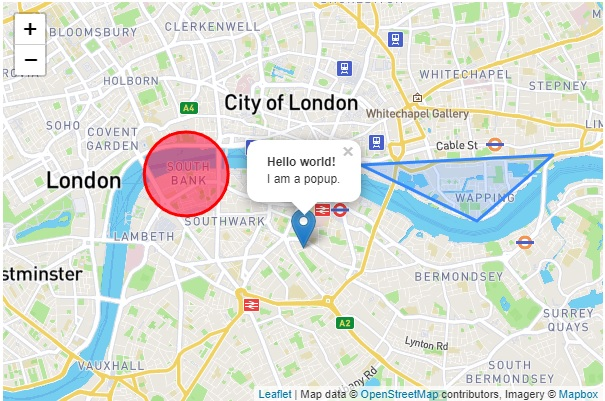

# Map

## Table of contents

- [Overview](#overview)
  - [The challenge](#the-challenge)
  - [Screenshot](#screenshot)
  - [Links](#links)
- [My process](#my-process)
  - [Built with](#built-with)
  - [What I learned](#what-i-learned)
  

## Overview

### The challenge

Users should be able to:

- View the map with different shapes and pins

### Screenshot

### Links

- Live Site URL: https://maciekgangus.github.io/Map/

## My process

### Built with

- Semantic HTML5 markup
- CSS custom properties

### What I learned

I learned how to use maps from Leaflet library
